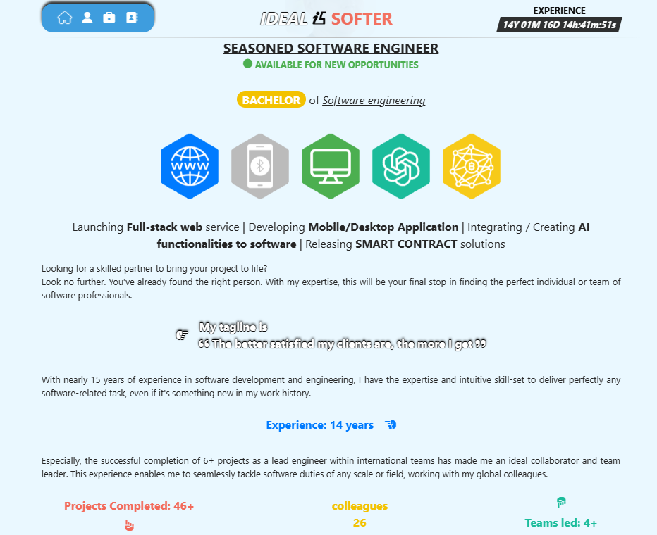

# Portfolio

This project is a modern, fully responsive portfolio website showcasing projects, skills, about him/herself and contact information. Built with **Vue/Nuxt.js**, **Tailwind CSS**, and **Sass**, this site includes a contact form powered by **Gmail SMTP** to enable secure and reliable sending email directly to manager.

---

## 🛠️ Tech Stack

- **Vue.js** & **Nuxt.js**: For building a dynamic, SEO-friendly single-page application.
- **Tailwind CSS**: Utility-first CSS framework for rapid styling and responsive design.
- **Sass**: For managing custom styling with modular, reusable CSS.
- **Gmail SMTP**: For sending messages securely via the contact form.

---

## 🚀 Features

### Project Showcase
- **Dynamic Projects**: Displays my projects with images, descriptions, and live links.
- **Nuxt.js Routing**: Smooth transitions and route handling for project pages.
- **Interactive Animations**: Subtle animations on hover and click for an engaging UI.

### Responsive Design
- **Mobile-First Layouts**: Built with Tailwind CSS to adapt seamlessly to different screen sizes.
- **Custom Breakpoints**: Tailored styling for desktops, tablets, and mobile devices.

### Contact Form with Gmail SMTP Integration
- **Direct Messaging**: Sends messages straight to my Gmail inbox for easy management.
- **Error Handling**: Notifies users if an email fails, ensuring a smooth experience.
- **Configurable in `.env`**: Gmail credentials stored securely in environment variables for privacy.

### Easy Styling with Sass
- **Modular Styling**: Uses Sass for organized, modular CSS.
- **Customizable Variables**: Easily update colors, typography, and layouts using Sass variables.

---
## Getting Started

To get a local copy up and running, follow these steps.

### Prerequisites

Make sure you have the following installed:

- Node.js (version 14.x or later)
- npm or yarn

## ⚙️ Installation

1. **Clone the repository**:
   ```bash
   git clone https://github.com/denysOstroverkh/portfolio.git
   cd portfolio
   npm install
   npm run dev

1. **Preview**:

